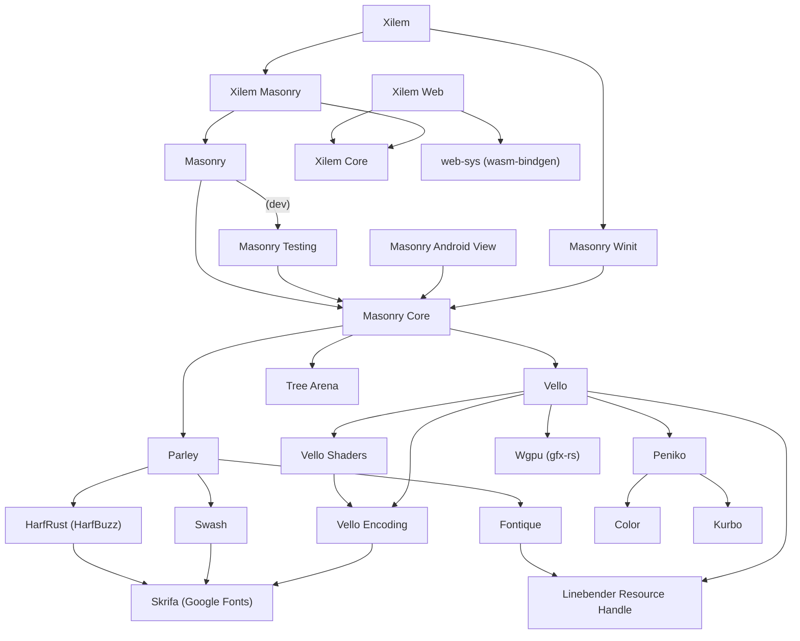

# ARCHITECTURE

This repository holds the source code for the Xilem project and the Masonry project, including their sub-crates.

- Xilem is a family of high-level GUI frameworks. Xilem apps are written with idiomatic Rust code, with little to no reliance on macros and DSLs.
    - **`xilem_core`** includes the traits that define Xilem.
    - **`xilem_masonry`** is the natively compiled framework, built on Masonry.
    - **`xilem`** is a batteries-included wrapper for `xilem_masonry` using `winit` for platform support.
    - **`xilem_web`** is the web framework, built on the DOM.
- Masonry is a foundational framework for building high-level Rust GUI libraries.
    - **`masonry_core`** includes the base GUI engine.
    - **`masonry_testing`** includes a harness, helper macros and functions, etc, for testing apps builts with Masonry.
    - **`masonry`** includes a baseline set of widgets and properties, a default theme, unit tests for widgets, and unit tests for `masonry_core`.
    - **`masonry_winit`** is the winit backend.

See [xilem/ARCHITECTURE.md](./xilem/ARCHITECTURE.md) and [masonry/ARCHITECTURE.md](./masonry/ARCHITECTURE.md) for more details on each project.

This repo also holds `tree_arena`, a crate which implements a hierarchical container, which has some properties of a tree (given a mutable reference to a node, you can get disjoint references to its value and children), while allowing `O(1)` (in unsafe mode) access to any element.

