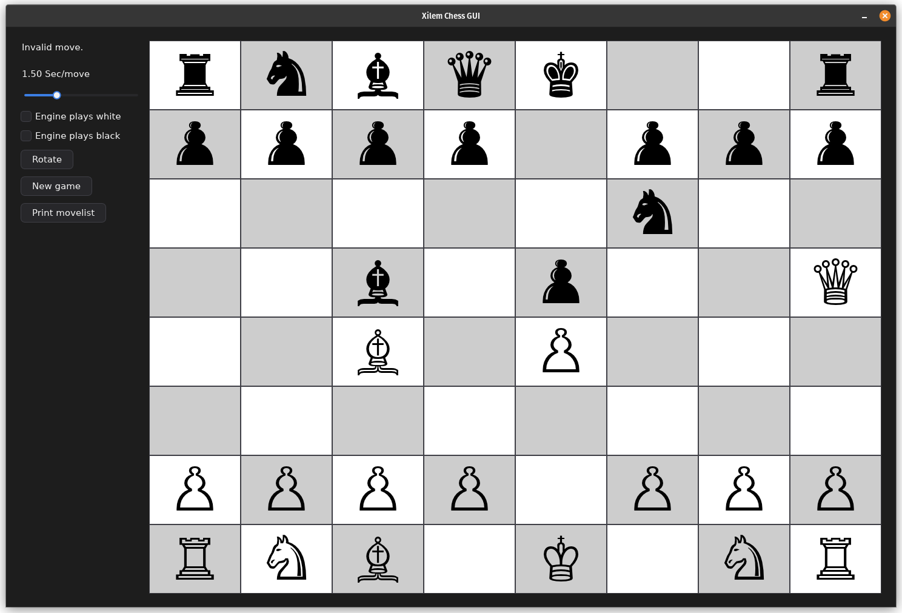

<div align="center">

# Xilem

**An experimental Rust architecture for reactive UI**

[](https://xi.zulipchat.com/#narrow/stream/354396-xilem)
[](https://github.com/linebender/xilem/actions)
[](https://deps.rs/repo/github/linebender/xilem)
[](#license)
[](https://docs.rs/xilem)

</div>

Xilem and Masonry provide an experimental high-level architecture for writing GUI apps in Rust.

**Masonry** is a foundational crate for building natively compiled GUIs in Rust.
It provides a retained widget tree and runs event handling and update passes on it.

**Xilem** a high-level reactive framework inspired by React, SwiftUI and Elm.
It lets users create a lightweight view tree, and changes the rendered app based on changes to the tree.
It has a web backend and a Masonry backend.

[`masonry/`](masonry/) and [`xilem/`](xilem/) are the respective entry points of these projects for new users. 
See `ARCHITECTURE.md` for details about the repository structure.

Xilem and Masonry are built on top of:

- **winit** for window creation.
- **Vello and wgpu** for 2D graphics.
- **Parley and Fontique** for [the text stack](https://github.com/linebender/parley#the-Parley-text-stack).
- **AccessKit** for plugging into accessibility APIs.

**Note for new users:** If you're not sure what to use between Xilem and Masonry, you probably want Xilem. In general, if you're trying to make an app with minimum hassle, you probably want Xilem. Xilem is a UI framework, whereas Masonry is a toolkit for building UI frameworks (including Xilem).


## Screenshots

<figure align="center">



<figcaption>

*From https://github.com/StefanSalewski/xilem-chess/*

</figcaption>
</figure>

<figure align="center">


<figcaption>

*The `calc_masonry` example.*

</figcaption>
</figure>

<figure align="center">


<figcaption>

*The `to_do_mvc` example.*

</figcaption>
</figure>


## Prerequisites

### Linux and BSD

You need to have installed `pkg-config`, `clang`, and the development packages of `wayland`, `libxkbcommon`, `libxcb`, and `vulkan-loader`.
Most distributions have `pkg-config` installed by default.

To install the remaining packages on Fedora, run:

```sh
sudo dnf install clang wayland-devel libxkbcommon-x11-devel libxcb-devel vulkan-loader-devel
```

To install the remaining packages on Debian or Ubuntu, run:

```sh
sudo apt-get install clang libwayland-dev libxkbcommon-x11-dev libvulkan-dev
```

There's a Nix flake in `docs/` which may be used for developing on NixOS:

> [!INFO]
>
> This flake is provided as a starting point, and we do not routinely validate its correctness.
> We do not require contributors to ensure that this accurately reflects the build requirements, as we expect most contributors (and indeed many maintainers) will not be using NixOS.
> If it is out of date, please let us know by opening an issue or PR.

```sh
# For all crates within this repo
nix develop ./docs
# For a specific crate
nix develop ./docs#xilem
nix develop ./docs#masonry
nix develop ./docs#xilem_web
```

## Recommended Cargo Config

The Xilem repository includes a lot of projects and examples, most of them pulling a lot of dependencies.

If you contribute to Xilem on Linux or macOS, we recommend using [`split-debuginfo`](https://doc.rust-lang.org/cargo/reference/profiles.html#split-debuginfo) in your [`.cargo/config.toml`](https://doc.rust-lang.org/cargo/reference/config.html#hierarchical-structure) file to reduce the size of the `target/` folder:

```toml
[profile.dev]
# One debuginfo file per dependency, to reduce file size of tests/examples.
# Note that this value is not supported on Windows.
# See https://doc.rust-lang.org/cargo/reference/profiles.html#split-debuginfo
split-debuginfo="unpacked"
```

## Minimum supported Rust Version (MSRV)

This version of Xilem has been verified to compile with **Rust 1.88** and later.

Future versions of Xilem might increase the Rust version requirement.
It will not be treated as a breaking change and as such can even happen with small patch releases.

## Community

Discussion of Xilem development happens in the [Linebender Zulip](https://xi.zulipchat.com/), specifically the [#xilem channel](https://xi.zulipchat.com/#narrow/stream/354396-xilem).
All public content can be read without logging in.

Contributions are welcome by pull request.
The [Rust code of conduct] applies.

Unless you explicitly state otherwise, any contribution intentionally submitted for inclusion in the work by you, as defined in the Apache 2.0 license, shall be licensed as noted in the [License](#license) section, without any additional terms or conditions.

## License

Licensed under the Apache License, Version 2.0 ([LICENSE](LICENSE) or <http://www.apache.org/licenses/LICENSE-2.0>)

Some files used for examples are under different licenses:

- The font file (`RobotoFlex-Subset.ttf`) in `xilem/resources/fonts/roboto_flex/` is licensed solely as documented in that folder (and is not licensed under the Apache License, Version 2.0).
- The data file (`status.csv`) in `xilem/resources/data/http_cats_status/` is licensed solely as documented in that folder (and is not licensed under the Apache License, Version 2.0).
- The data file (`emoji.csv`) in `xilem/resources/data/emoji_names/` is licensed solely as documented in that folder (and is not licensed under the Apache License, Version 2.0).

[Html.lazy]: https://guide.elm-lang.org/optimization/lazy.html
[Html map]: https://package.elm-lang.org/packages/elm/html/latest/Html#map
[Rc::make_mut]: https://doc.rust-lang.org/std/rc/struct.Rc.html#method.make_mut
[AnyView]: https://developer.apple.com/documentation/swiftui/anyview
[Panoramix]: https://github.com/PoignardAzur/panoramix
[Xilem: an architecture for UI in Rust]: https://raphlinus.github.io/rust/gui/2022/05/07/ui-architecture.html
[xkbcommon]: https://github.com/xkbcommon/libxkbcommon
[Rust code of conduct]: https://www.rust-lang.org/policies/code-of-conduct
