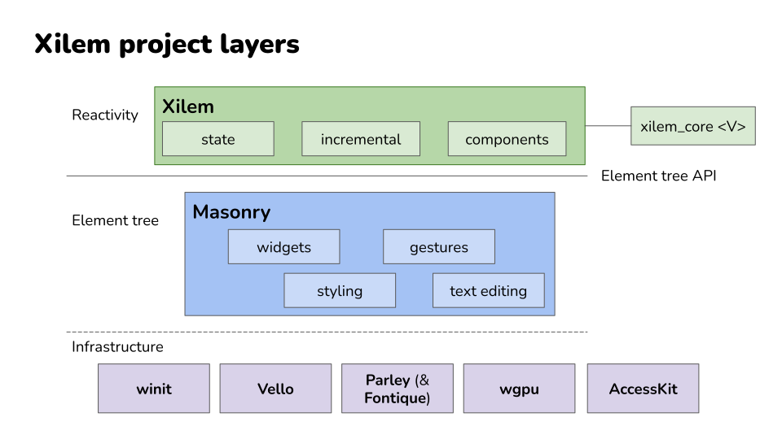

# What is Xilem?

At its heart, Xilem is an answer to a question that's been nagging Rust developers for years: **how do you build graphical interfaces that feel natural to write in Rust, without fighting the borrow checker at every turn or abandoning the language's strengths?**

Traditional GUI frameworks often clash with Rust's ownership model. They expect you to store mutable references to widgets in multiple places, update them imperatively when things change, and generally do the kinds of things that make the borrow checker unhappy. You can make it work - people have - but it often feels like you're working *against* the language rather than *with* it.

Xilem takes a fundamentally different approach borrowed from the reactive frameworks that have transformed web development over the past decade. To understand what makes it different, we first need to look at how GUI frameworks work in general.

## Understanding GUI Paradigms

Before we look at how Xilem works specifically, it helps to understand the fundamental approaches to building graphical interfaces. There are three main paradigms you'll encounter in GUI development, and understanding these will clarify what makes Xilem different and why certain design decisions were made.

### Immediate Mode: Redrawing Everything Every Frame

In an immediate mode GUI, you redescribe your entire interface from scratch every time the screen needs to update - typically many times per second. Think of it like drawing on a whiteboard: you erase everything and redraw the complete picture each time something changes.

Here's what immediate mode code looks like in pseudocode:

```rust
// This loop runs continuously, maybe 60 times per second
loop {
    // We describe the interface fresh every iteration
    if button("Click me") {
        counter += 1;
    }
    
    label(&format!("Count: {}", counter));
    
    if button("Reset") {
        counter = 0;
    }
}
```

Notice how we're not creating button and label objects that persist. We're simply describing that a button exists, right here in the code, and checking if it was clicked. The widgets themselves are recreated every frame.

This approach has significant advantages: the code is remarkably simple and direct, you never have to worry about keeping UI state synchronized with application state because the UI is rebuilt every frame, and there are no complex object lifetimes to manage. These benefits make immediate mode particularly popular for developer tools, debugging interfaces, and editor UI.

The trade-offs come with efficiency and capability. Redescribing everything every frame uses more CPU than updating only what changed, smooth animations and transitions require careful handling since the UI is constantly being recreated, and integration with system accessibility features can be challenging since there's no persistent widget tree for screen readers to navigate.

### Retained Mode: Long-Lived Widget Objects

Retained mode is what most traditional GUI frameworks use. You create widget objects once, they stay in memory for as long as they're needed, and you update specific properties on specific widgets when things need to change. It's like building with blocks: you construct your interface piece by piece, and those pieces remain until you explicitly remove them.

Here's what the same counter looks like in retained mode pseudocode:

```rust
// Setup phase (happens once)
let button = Button::new("Click me");
let label = Label::new("Count: 0");
let reset_button = Button::new("Reset");

// Store references to these widgets somehow
let mut counter = 0;

// Set up event handlers
button.on_click(move || {
    counter += 1;
    label.set_text(&format!("Count: {}", counter));
});

reset_button.on_click(move || {
    counter = 0;
    label.set_text("Count: 0");
});

// Add widgets to window and run event loop
window.add(button);
window.add(label);
window.add(reset_button);
window.run();
```

You can see the difference: the button and label are objects you create and keep references to. When something changes, you have to explicitly update the relevant widgets. The `button.on_click()` callback has to know about the `label` and manually call `set_text()` on it.

Retained mode is more efficient than immediate mode because you only update what actually changed, it integrates naturally with operating system accessibility features since there's a real widget tree that persists, and it's better suited for complex animations and transitions since widgets maintain their state between frames.

The significant downside is complexity. You have to manage references to widgets (which in Rust means fighting with the borrow checker), your application state and UI state can get out of sync if you forget to update something, and the update logic gets scattered across multiple event handlers as your application grows.

### Declarative: Describing What, Not How

Declarative GUIs take a different approach: you write a function that describes what the interface should look like based on your application state, and the framework figures out how to make the actual interface match that description. You're specifying the desired result, not the steps to achieve it.

Here's the counter in a declarative style:

```rust
fn app_view(counter: i32) -> View {
    Column::new()
        .child(Button::new("Click me"))
        .child(Label::new(&format!("Count: {}", counter)))
        .child(Button::new("Reset"))
}

// Somewhere in your application loop:
// 1. Handle events (button clicks update the counter variable)
// 2. Call app_view(counter) to get a description of the interface
// 3. Framework diffs this against the previous description
// 4. Framework updates only the widgets that actually changed
```

Notice the fundamental shift: `app_view()` doesn't update anything. It doesn't have to know which specific label widget needs its text changed. It just says "given this counter value, here's what the interface looks like." The framework handles the rest.

This is the approach Xilem takes. When the counter changes from 5 to 6, you call `app_view(6)`, get a new description, and Xilem figures out that only the label's text needs to update - it doesn't recreate the entire interface.

The advantages are substantial: your code is easier to read and reason about because there's one clear function showing what the interface looks like for any state, state management is simpler because the state lives in one place rather than scattered across widgets, and in Rust specifically, this approach works beautifully with ownership rules because you're not holding long-lived references to widgets.

The main requirement is that the framework must be sophisticated enough to efficiently diff your interface descriptions and apply minimal updates. This is exactly what Xilem does with its reconciliation engine.

## The Reactive Model

Now that you understand the three main GUI paradigms, let's talk about where Xilem sits and what "reactive" actually means in practice.

As we saw in the declarative paradigm, you describe what your interface should look like, and the framework handles making it happen. Reactive programming takes this idea and adds an important piece: **automatic synchronization between your application state and the interface**. When your state changes, the framework automatically calls your view function with the new state, gets the updated description, and figures out what needs to change in the actual UI.

This is what "reactive" means - the UI *reacts* to changes in your state without you having to manually orchestrate the updates. You write a pure function from state to UI description, and the framework handles everything else. Your application state lives in one place - not scattered across widgets - and the UI is always an accurate reflection of that state.

> This approach has a profound effect on how you think about building interfaces. Instead of orchestrating sequences of updates ("when this button is clicked, update that label, then enable this button, then..."), you think in terms of transformations: **given this state, the interface looks like this**. The function from state to UI description becomes the single source of truth about what your application looks like at any moment.

Here's something important that might surprise you: when you're actually building an application with Xilem, you often won't *feel* like you're explicitly "managing state" or "describing the interface for any given state." The abstractions work so naturally that you simply describe your interface, and it works. You're not constantly thinking "now I need to handle this state transition" - you just write what the interface should be, and the state management happens almost invisibly. This is by design. The goal is for the reactive model to feel effortless once you understand the basic pattern, not to make you constantly aware of the machinery underneath.

## Xilem's Architecture

Xilem doesn't operate in isolation. It's built as a layer on top of **Masonry**, which itself sits on top of a stack of specialized Rust libraries. Understanding how these pieces fit together helps clarify what Xilem is and isn't responsible for.

**Masonry** is the foundation. It's a widget toolkit that handles the low-level details of GUI work: managing a tree of widgets, routing events like mouse clicks and key presses, calculating layouts, and rendering everything to the screen. Masonry gives you widgets like buttons, text boxes, and containers, but you interact with them somewhat imperatively. You could build a complete application directly with Masonry if you wanted to, but you'd be writing a lot of manual update logic.

**Xilem** sits on top of Masonry and provides the reactive layer. When you write a Xilem application, you're creating view trees that Xilem reconciles against the actual Masonry widget tree. Xilem handles the diffing and update logic automatically, so you never have to manually tell a widget to update. You just describe what the interface should be, and Xilem makes it happen.



Below Masonry, there's an ecosystem of specialized libraries handling specific concerns:

- **Vello** does the actual 2D rendering using GPU compute shaders
- **Parley** handles text layout and shaping  
- **AccessKit** integrates with platform accessibility APIs
- **Winit** manages windows and handles the platform-specific details of creating GUI applications on Windows, macOS, and Linux

Xilem benefits from all of these, but you rarely need to think about them directly.


> **Think of it like this:** If you were building a car:
> - Vello and Parley would be the engine and transmission - powerful, specialized components that do specific jobs well.
> - Masonry would be the chassis and controls. It gives you a complete vehicle you could theoretically drive.
> - Xilem is the automatic transmission and cruise control. It takes the mechanical complexity and gives you a smoother, more pleasant driving experience.

## How Xilem Differs from Other Approaches

If you've explored GUI options in Rust before, you've probably encountered a few different philosophies about how to build interfaces. Now that you understand the three main GUI paradigms, let's look at how various Rust frameworks implement them and where Xilem fits in.

### Immediate Mode: EGUI

**EGUI** is the most popular immediate mode GUI framework in Rust. As we discussed in the previous section, it redraws the interface every frame, which makes the code remarkably straightforward. You write what looks like a simple loop that describes your interface, and it just works.

EGUI excels at developer tools and debugging interfaces - situations where you need to quickly throw together a functional UI and don't care about perfectly matching system design language or having the most optimized rendering. The simplicity is a major strength: there are no complex state management patterns to learn, no widget lifetime issues to wrestle with, and the mental model is about as simple as GUI programming gets.

The trade-off is that EGUI's approach makes some things difficult. Because the UI is regenerated every frame, smooth animations require careful coordination, integration with operating system accessibility features is limited, and you're always using some CPU to redraw even when nothing changed. For applications where battery life matters or where you need deep platform integration, these limitations can be significant.

### Declarative Native: GPUI and Lapce

**GPUI**, the framework behind the Zed editor, and **Lapce's** GUI framework both take declarative approaches similar to Xilem, but with different implementation details and focus areas.

GPUI was built specifically to support a high-performance code editor, which shapes many of its design decisions. It uses a declarative API where you describe your interface based on application state, but it's optimized heavily for the specific patterns that editors need: rendering large amounts of text efficiently, handling complex syntax highlighting, and managing multiple cursor positions. The framework has proven itself in production - Zed is a real application that people use daily - which gives confidence in the approach.

Lapce similarly built its own declarative GUI framework to support editor use cases. Like GPUI, it demonstrates that you can build production-quality applications with this programming model in Rust.

What distinguishes Xilem from these editor-focused frameworks is scope and intent. GPUI and Lapce's frameworks were built to solve specific problems for specific applications. Xilem aims to be a general-purpose GUI framework that works well for any kind of application. The Xilem team is thinking about developer tools, yes, but also business applications, creative tools, games, and anything else you might build with a GUI. That broader scope means different trade-offs in the API design and optimization targets.

### Declarative Cross-Platform: QML

Outside the Rust ecosystem, **QML** (Qt Modeling Language) is worth mentioning as another declarative approach, though it targets C++ rather than Rust. QML lets you describe interfaces using a JSON-like syntax, and the Qt framework handles rendering and updates. It's been used in production for years in everything from automotive interfaces to desktop applications.

QML demonstrates that declarative GUIs can work at scale and in demanding environments. However, when you use QML from Rust (through Qt bindings), you encounter the same impedance mismatch issues that any C++ framework brings: the borrow checker fights against APIs that expect shared mutable state, and you end up writing Rust that doesn't feel quite natural because you're working around assumptions the underlying library makes.

### Bindings to Traditional Frameworks

Some frameworks, like **gtk-rs** or **Qt bindings**, wrap existing C or C++ libraries and give you Rust bindings to them. These are mature and feature-complete, but they carry the design assumptions of their underlying libraries, which weren't built with Rust's ownership model in mind. You spend time working around impedance mismatches between Rust and the imperative APIs you're calling.

These bindings give you access to decades of development effort and extensive widget libraries, which is valuable. But the experience of using them in Rust often feels like you're fighting the language rather than working with it. The frameworks expect you to pass around mutable references to widgets and share state in ways that Rust's ownership system resists.

### Web Technology: Tauri and Dioxus

**Tauri** and **Dioxus** take the web stack approach, rendering your UI with HTML, CSS, and JavaScript (or WebAssembly). This gives you access to the mature ecosystem of web technologies and can be a great choice if you're already comfortable there. The trade-off is that you're running a web browser engine in your application, which has implications for resource usage and the kinds of native integrations you can easily do.

For some applications, especially those that already have web versions or where rapid iteration on visual design is important, this approach makes perfect sense. The web platform has solved many hard problems around layout, text rendering, and styling, and leveraging that work can save significant development time.

> **Xilem's bet** is that building GUI frameworks natively in Rust, from the ground up, will eventually give you the best of all worlds: native performance and integration, a programming model that works naturally with Rust's ownership system, and full control over the entire stack.

The framework is still young, so it doesn't yet have the maturity or feature completeness of alternatives that have been around longer. But the architecture is designed to get there eventually. Unlike frameworks built for specific applications like editors, Xilem aims to be general-purpose. Unlike bindings to C++ frameworks, it's designed from the start to work with Rust's ownership model. And unlike web-based approaches, it controls the entire rendering stack, which opens possibilities for optimization and integration that wouldn't be possible otherwise.

## What Makes Xilem "Xilem"

Three core ideas define what Xilem is and how it approaches GUI development in Rust.

### Views Are Data, Not Objects

When you create a button in Xilem, you're not constructing an object that will live for the lifetime of your application. You're creating a lightweight description of a button that exists just long enough to be compared against the previous description and used to update the real widget tree.

This might feel strange at first if you're used to frameworks where widgets are long-lived objects you hold references to, but it's what allows Xilem to work smoothly with Rust's ownership rules. You never need to worry about managing the lifetime of a widget or storing mutable references to UI elements.

### State Flows Downward, Events Flow Upward

Your application maintains centralized state, and view functions transform that state into interface descriptions that flow down into the widget tree. When users interact with the interface - clicking buttons, typing text, dragging sliders - events flow back up through callbacks that modify the application state.

This **unidirectional data flow** makes it much easier to reason about how your application behaves than frameworks where state and logic can live anywhere.

### The Framework Handles Reconciliation Automatically

You never write code that says "when this state changes, update that widget's text property and this other widget's color." Instead, you write a function that describes the entire interface for any given state, and Xilem efficiently figures out what actually needs to change.

This reconciliation happens behind the scenes using techniques like tree diffing and memoization to ensure that only the parts of your interface that actually changed get updated.

---

## Where Xilem Is Going

The reactive architecture is in place and working. You can build applications with Xilem today and see how this programming model feels in practice. What's still evolving is the specific API surface - exactly how you express common patterns, what abstractions the framework provides for composition and reuse, and how to handle advanced scenarios that emerge as people build more complex applications.

The Xilem team is actively experimenting with different approaches to problems like component composition, state management, and performance optimization. Some of these experiments will work out and become permanent parts of the framework. Others will turn out to be dead ends and get replaced with better ideas. This is the normal process of designing a framework, just happening in public where you can see it and participate if you choose.

> **What this means for you:** Xilem gives you the reactive programming model and the integration with Masonry's widget toolkit, but the exact details of how you use these pieces together are still being refined. The core concepts - view trees, reconciliation, unidirectional data flow - will remain stable even as the API evolves around them.

## Moving Forward

Now that you understand what Xilem is trying to accomplish and how it fits into the broader landscape of Rust GUI development, you're ready to see it in action. The next chapter will walk you through installing Xilem and setting up your development environment. After that, we'll build your first application and examine exactly how the reactive model works in practice.

Understanding these concepts before diving into code will help everything click into place as you work through the examples. You'll recognize the view tree being constructed, see the reconciliation happening, and understand why the code is structured the way it is. That conceptual foundation makes learning the specifics much faster and less confusing.