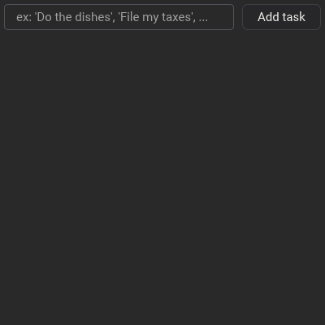
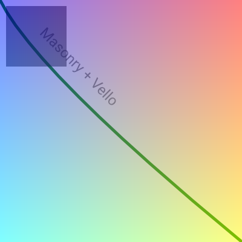
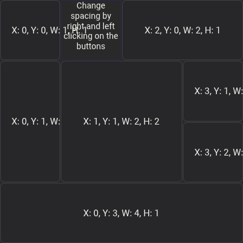

# Masonry examples

## `hello_masonry`

Simplest possible Masonry app.

## `calc_masonry`

Calculator app.

## `to_do_list`

To-do list app.

## `custom_widget`

Static render showing off Vello's capabilities.

## `grid_masonry`

Demonstration of the grid layout.

## `simple_image`

Simple image example.

## `layers`

Demonstration of the layer system with a simple tooltip.

## `gallery`

A simple widget gallery showcasing a few common widgets and the "driver + mutate" architecture.
