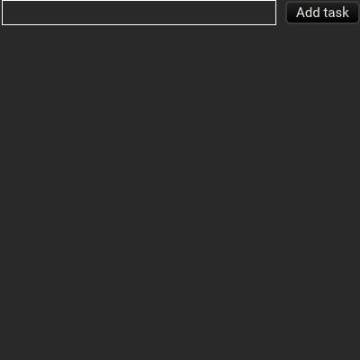
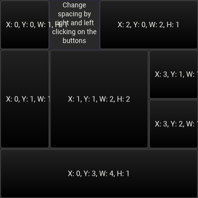

# Masonry examples

## `tests.rs`

This module imports the widgets generated by most other examples and runs screenshot tests to check that the examples render correctly.
The screenshots below are generated from those tests.

## `hello_masonry`

Simplest possible Masonry app.

## `two_textboxes`

Example used to test text input and text focus.

## `calc_masonry`

Calculator app.

## `to_do_list`

To-do list app.

## `custom_widget`

Static render showing off Vello's capabilities.

## `grid_masonry`

Demonstration of the grid layout.

## `simple_image`

Simple image example.
