# Xilem examples

## `calc`

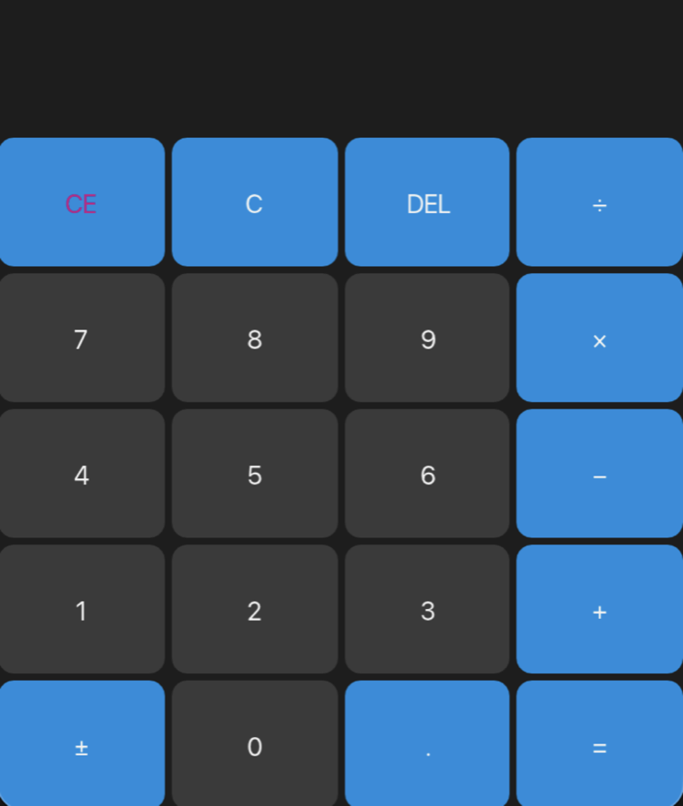

Calculator app.

## `canvas`

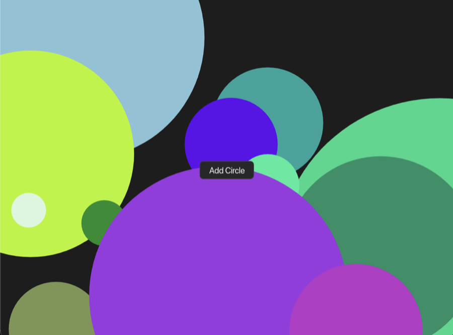

Canvas demo that draws random circles with a Vello scene.

## `components`

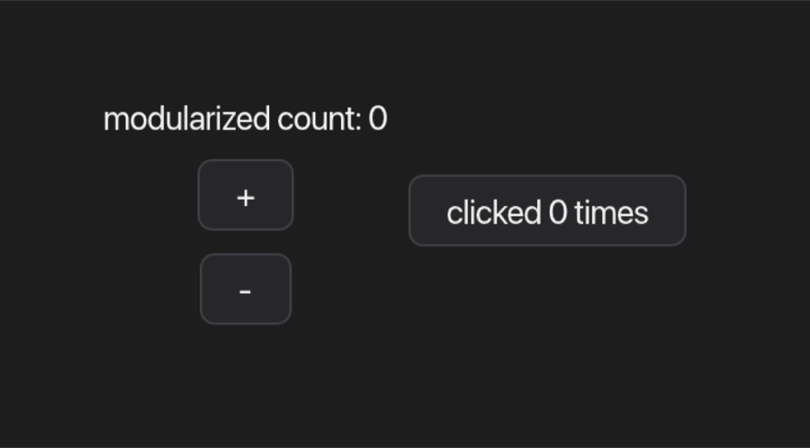

Demonstration of modular state and reusable components via `lens`.

## `elm`

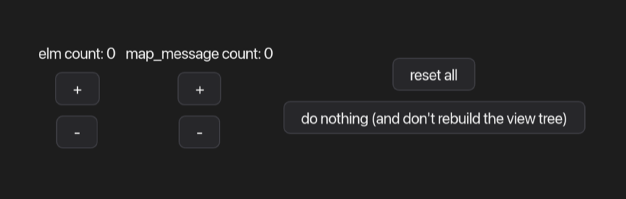

Demonstration of Elm-style message handling with `map_action` and `map_message`.

## `emoji_picker`

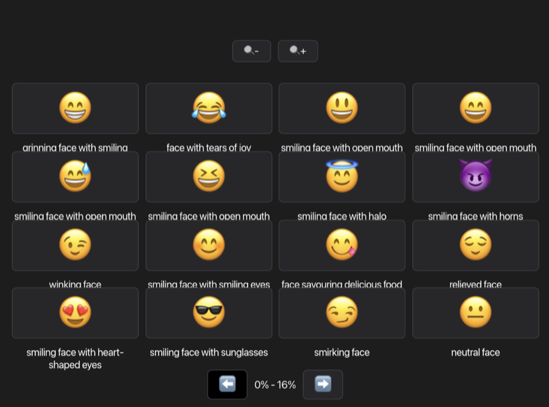

Emoji picker app with zoom and pagination.

## `external_event_loop`

Demonstration of embedding Xilem into an external Winit event loop.

## `flex`

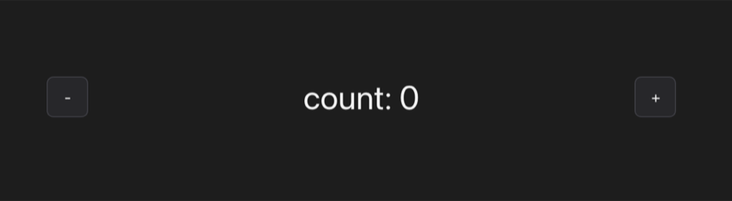

Flex layout example.

## `http_cats`

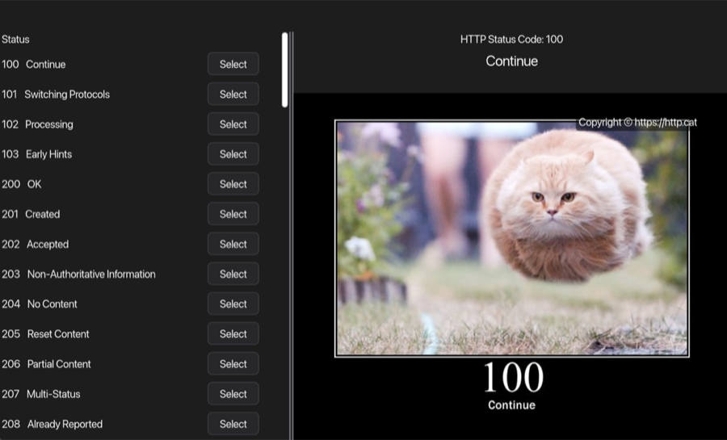

Async HTTP requests and image loading example.

## `lists`

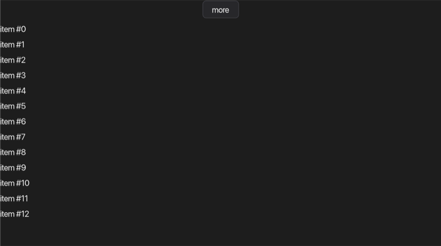

Variable-length list example using a `Vec` as flex children.

## `mason`

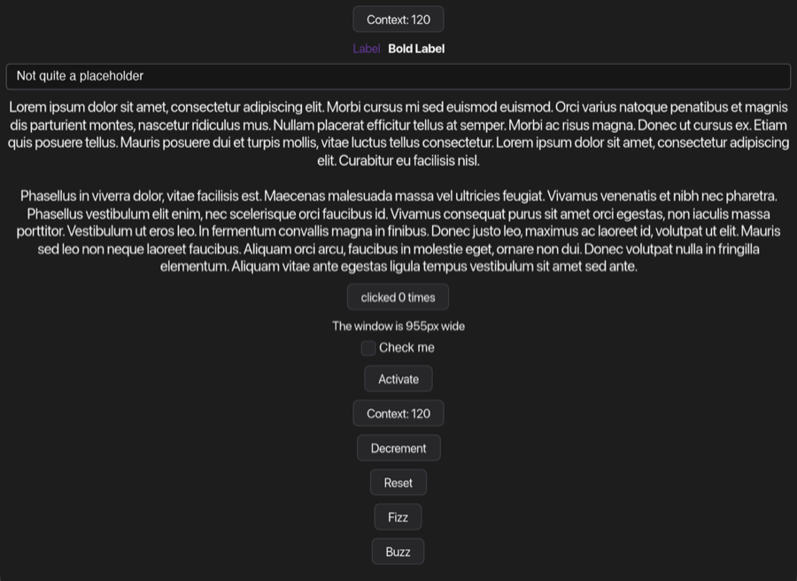

Feature playground for Xilem and Masonry APIs.

## `memoization`

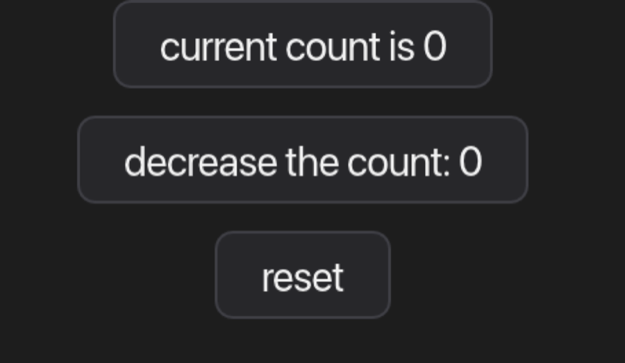

Memoization example to reduce view rebuild work.

## `multiple_windows`

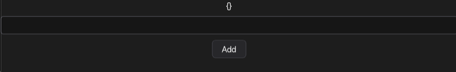

Multi-window app.

## `scroll`

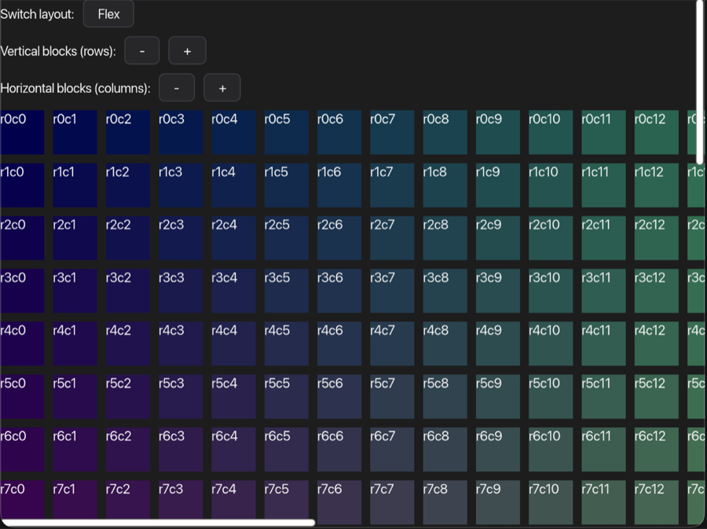

Portal widget example with scrollable content.

## `slider_demo`

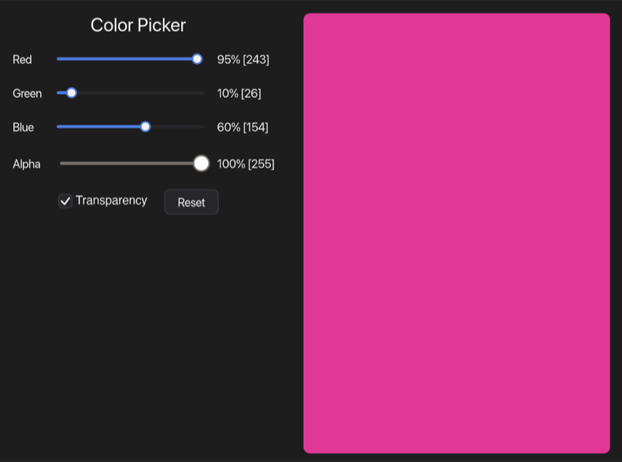

Slider-based RGBA color picker.

## `state_machine`

A state machine to detect whether the button was pressed an even or an odd number of times.

## `stopwatch`

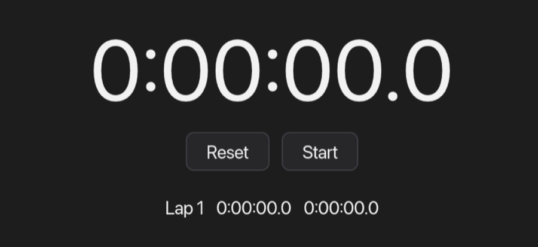

Stopwatch app.

## `to_do_mvc`

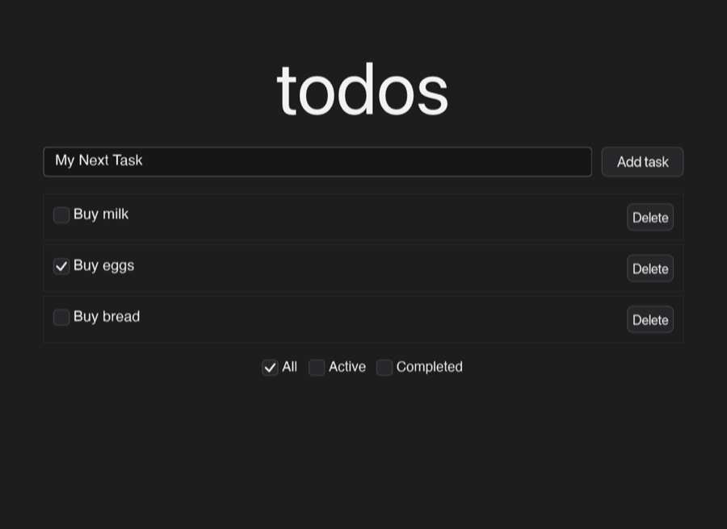

TodoMVC-inspired to-do-list app.

## `transforms`

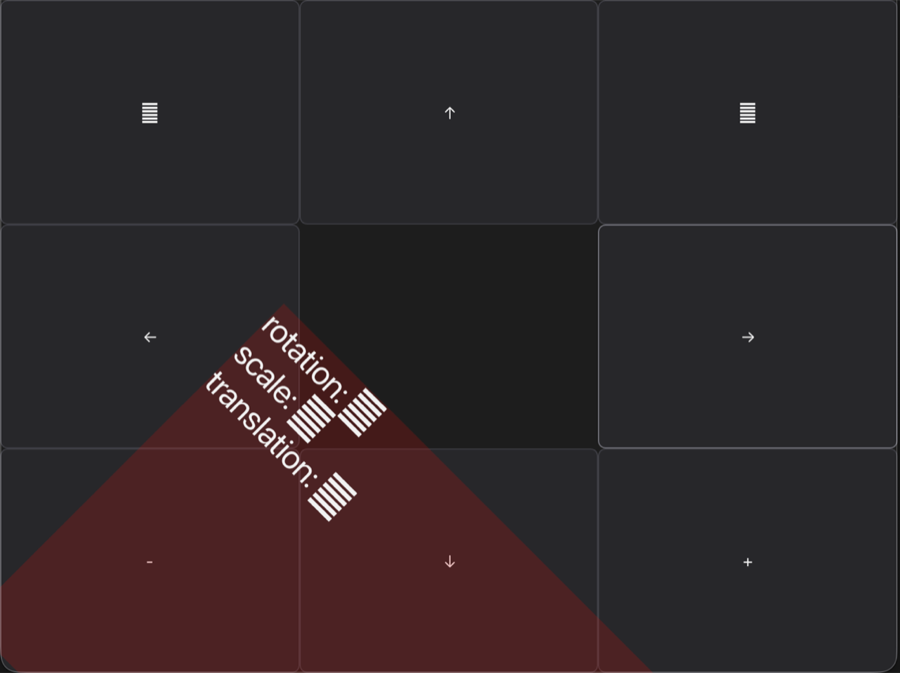

2D transform example (rotation, translation, and scale).

## `transparent_window`

Transparent window app with adjustable opacity.

## `variable_clock`

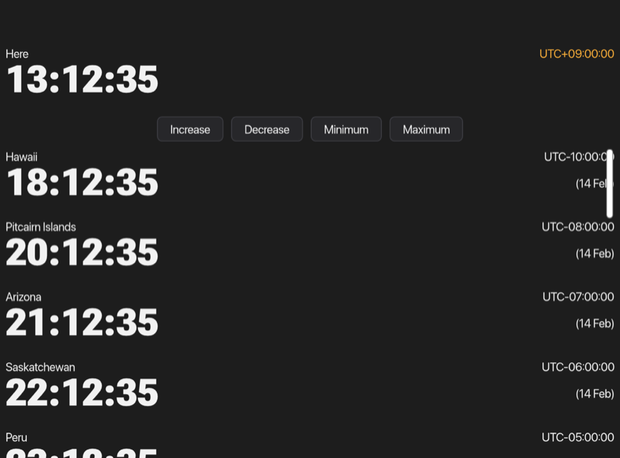

World clock using variable-font rendering.

## `virtual_cats`

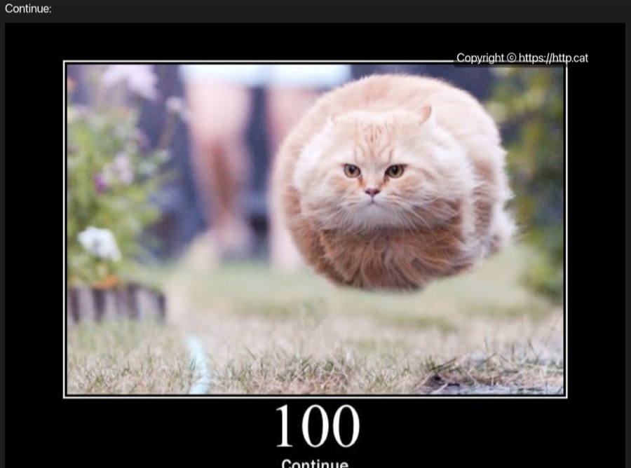

Virtual-scrolling list with lazy-loaded cat images.

## `widgets`

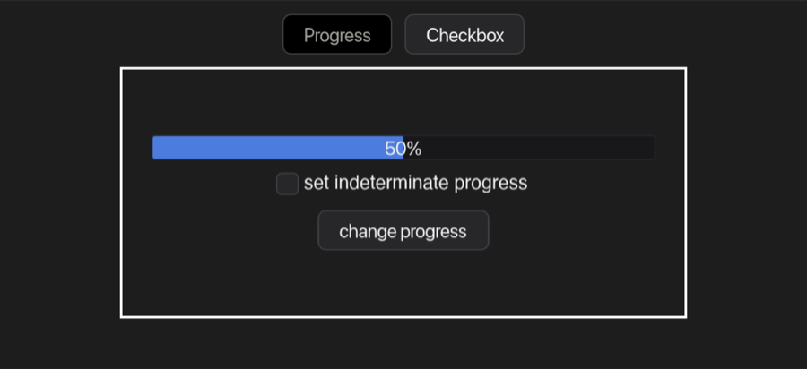

Gallery of common widgets.

